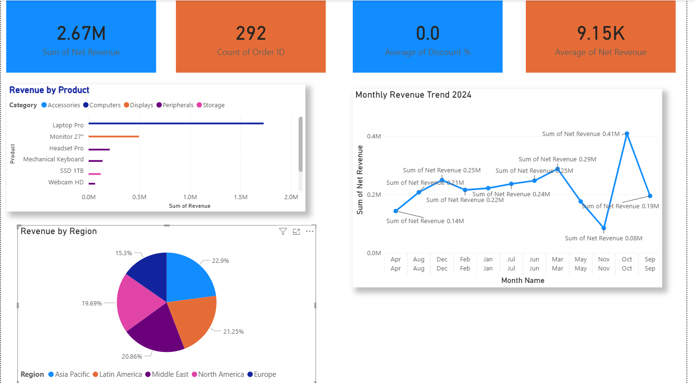

# 📊 Sales Dashboard 2024
**Tools Used:** Microsoft Excel | Power BI | Data Analysis**

---

## 📌 Project Overview
This project analyzes sales data for the year 2024 across multiple regions, products, and months.  
I built an interactive Excel workbook and a Power BI dashboard to uncover business insights.

---

## 🎯 Business Questions Answered
- Which region generates the most revenue?
- What are the top-selling products?
- How does revenue trend month by month?
- What is the average order value?

---

## 🛠️ Tools & Skills Used
| Tool | Purpose |
|------|---------|
| Microsoft Excel | Data cleaning, pivot tables, charts |
| Power BI | Interactive dashboard, DAX measures |
| GitHub | Version control, portfolio sharing |

---

## 📁 Project Structure
```
sales-dashboard/
│
├── data/
│   └── Sales_Dashboard_2024.xlsx     ← Raw data + Excel analysis
│
├── powerbi/
│   └── Sales_Dashboard.pbix          ← Power BI report file
│
├── screenshots/
│   ├── dashboard_overview.png
│   ├── monthly_trend.png
│   └── region_breakdown.png
│
└── README.md
```

---

## 📸 Dashboard Preview



---

## 📈 Key Insights Found
1. **North America** is the top revenue region
2. **Laptop Pro** is the best-selling product by revenue
3. Revenue peaks in **Q4** (October–December)
4. Average order value is approximately **$1,200**

---

## 🚀 How to Use This Project
1. Download `Sales_Dashboard_2024.xlsx` and open in Excel
2. Download `Sales_Dashboard.pbix` and open in [Power BI Desktop (free)](https://powerbi.microsoft.com/downloads/)
3. Explore the interactive visuals!

---

## 👤 About Me
I am learning data analytics and building projects to grow my skills.  
This is Project #1 in my portfolio.

📧 emmanuvelchristin2@@gmail.com 
🔗 https://www.linkedin.com/in/emmanuvel-christin-63b585264

---
*Created with ❤️ as part of my data analytics learning journey*
